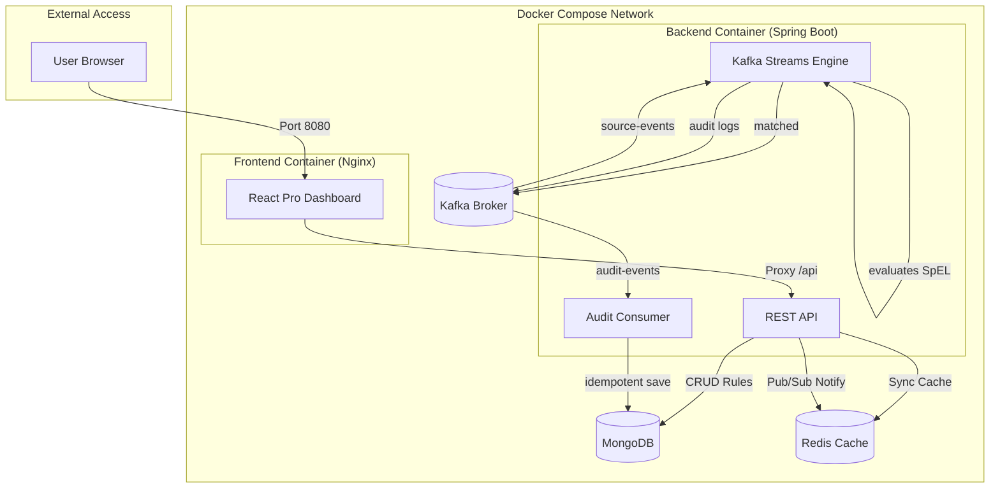

# Spring-Kafka-Stream-Rules

A Kafka Streams pipeline that evaluates database-stored SpEL rules against JSON events, routes matches, and audits *every* event to MongoDB — exactly-once.

`Java 21` `Spring Boot 3.3.5` `React 18` `Tailwind CSS 4` `Kafka Streams (EOS v2)` `MongoDB` `Redis` `Docker Compose`

## What it does

Consume JSON events from a **source** topic. For each event, evaluate a set of **SpEL boolean rules**. If **any** rule matches (any-match), the event is routed to a **target** topic. For **every rule** evaluated against an event, an **audit record** is produced to an internal **audit** topic *inside the same exactly-once transaction*. This provides a granular audit trail showing exactly why each rule matched or failed. A separate consumer drains the audit topic and writes records to **MongoDB** with an idempotent upsert (effectively-once).

> [!NOTE]
> Kafka EOS does not span the Mongo write (no XA is possible across Kafka + Mongo). The audit topic + deterministic `auditId` + idempotent upsert give **effectively-once** persistence instead.

## Architecture

The system is fully containerized and decoupled, separating the high-performance streaming engine from the administrative Rules Engine Dashboard.

### Processing Model: Sync vs Async

| Layer | Nature | Reason |
| :--- | :--- | :--- |
| **Stream Evaluation** | **Synchronous** | Guarantees sub-millisecond latency and Exactly-Once Semantics (EOS). Every rule is evaluated in-memory before the transaction commits. |
| **Audit Persistence** | **Asynchronous** | Decouples the database (MongoDB) from the streaming hot-path. Prevents DB pressure from causing Kafka consumer lag. |
| **Rule Updates** | **Reactive** | Uses Redis Pub/Sub to instantly invalidate caches across multiple instances without restarting the streams. |
| **Analytics** | **Reactive** | Uses non-blocking MongoDB aggregations to provide real-time dashboards without impacting API responsiveness. |

### Performance: Millisecond Processing

The system achieves sub-millisecond evaluation times by:
1. **Pre-compiled Rules:** SpEL expressions are compiled into executable objects upon loading, not per-message.
2. **L1 Cache (RuleCache):** Rules are held in a local `ConcurrentHashMap` for zero-latency lookup during stream processing.
3. **Optimized JSON Access:** Uses `SimpleEvaluationContext` for high-performance, read-only data binding.
4. **Bulk Fan-out:** Every evaluation results in a dedicated audit record, batched within the Kafka Producer transaction.

### Application Flow

The following diagram illustrates the lifecycle of an event as it moves through the system, highlighting the transactional boundaries and the asynchronous audit persistence.

#### Visual Flow

```text
  [ Input ]          [ Kafka Streams Engine (Sync/EOS) ]          [ Persistence ]
      │                         (Transaction)                          (Async)
      │                               │                                   │
┌─────▼─────┐           ┌─────────────▼─────────────┐             ┌───────▼───────┐
│  Source   │           │ 1. Read JSON Event        │             │ 4. Reactive   │
│  Events   ├──────────▶│ 2. Evaluate SpEL Rules    │             │    Subscribe  │
└───────────┘           │ 3. Fan-out Results        │             └───────┬───────┘
                        └──────┬──────────────┬─────┘                     │
                               │              │                   ┌───────▼───────┐
                        IF MATCHED      ALWAYS (Audit)            │ 5. Idempotent │
                               │              │                   │    Upsert     │
                        ┌──────▼──────┐┌──────▼──────┐            └───────┬───────┘
                        │   Target    ││    Audit    │◀── (Topic) ────────┘
                        │   Events    ││    Events   │            ┌───────▼───────┐
                        └─────────────┘└─────────────┘            │ 6. Kafka Ack  │
                                                                  └───────────────┘
```

#### Detailed Lifecycle (Mermaid)
flowchart LR
    subgraph Input["Input Stage"]
        Source[("source-events")]
    end

    subgraph Streaming["Kafka Streams Engine (Sync/Transactional)"]
        direction TB
        Read["1. Read Event"]
        Eval["2. Evaluate Rules (in-memory)"]
        Route{"3. Match Found?"}
        Target[("target-events")]
        AuditTopic[("audit-events")]

        Read --> Eval
        Eval --> Route
        Route -- "Yes" --> Target
        Route -- "Always" --> AuditTopic
    end

    subgraph Persistence["Audit Consumer (Async/Reactive)"]
        direction TB
        Consume["4. Reactive Subscribe"]
        Upsert["5. Idempotent Upsert"]
        Mongo[("MongoDB (audits)")]
        Ack["6. Kafka Acknowledge"]

        AuditTopic -.-> Consume
        Consume --> Upsert
        Upsert --> Mongo
        Mongo --> Ack
    end

    Source --> Read

    style Streaming fill:#f9f9f9,stroke:#333,stroke-dasharray: 5 5
    style Persistence fill:#f0f4ff,stroke:#0052cc
```

### Flow Breakdown

1.  **Ingestion:** The `RoutingProcessor` (Kafka Streams) consumes a JSON event from the `source-events` topic.
2.  **Synchronous Evaluation:**
    *   The event is evaluated against all active rules stored in the local `RuleCache`.
    *   Evaluation happens in-memory using pre-compiled SpEL expressions for sub-millisecond latency.
3.  **Transactional Routing & Fan-out:**
    *   If **any** rule matches, the original event is sent to the `target-events` topic.
    *   For **every** rule evaluated, a granular `AuditRecord` (containing result and reason) is sent to the `audit-events` topic.
    *   *Crucial:* Both the target route and the audit fan-out happen within the **same Kafka Transaction**. If one fails, nothing is committed.
4.  **Reactive Persistence:**
    *   The `AuditConsumer` subscribes to the `audit-events` topic.
    *   It uses **Spring Data MongoDB Reactive** to perform non-blocking, idempotent upserts into the `audits` collection.
    *   The Kafka offset is only acknowledged *after* the MongoDB write is confirmed, ensuring "effectively-once" delivery.

### Visual Architecture

```text
    ┌─────────────────────┐
    │    User Browser     │
    └──────────┬──────────┘
               │ Port 8080
               ▼
    ┌─────────────────────┐         ┌────────────────────────┐
    │   Nginx Container   │         │  Docker Compose Stack  │
    │ (React Dashboard)   │         └──────────┬─────────────┘
    └──────────┬──────────┘                    │
               │ Proxy /api                    │
               ▼                               │
    ┌─────────────────────┐                    │
    │ Backend (Spring)    │                    │
    │ REST API / Streams  │◀───────────────────┘
    └──────────┬──────────┘
               │
      ┌────────┴────────┬─────────────────┐
      │                 │                 │
      ▼                 ▼                 ▼
┌──────────┐      ┌──────────┐      ┌──────────┐
│ MongoDB  │◀────▶│  Kafka   │◀────▶│  Redis   │
│ (Audits) │      │ (Events) │      │ (Cache)  │
└──────────┘      └──────────┘      └──────────┘
```

### Detailed Flow (Mermaid)



## Features

### 🚀 Pro Dashboard (UI)
- **Rule Management:** Create, edit, and delete SpEL rules with real-time status badges.
- **Analytics View:** Tabbed dashboard showing real-time message throughput, evaluation counts, and per-rule performance (Matched vs. Unmatched vs. Errored).
- **Advanced Search:** Live filtering by rule description or SpEL expression.
- **Modern Stack:** Built with React 18, Vite, Tailwind CSS 4, and Lucide icons.
- **Decoupled Deployment:** Served via Nginx in a separate container for independent scaling.

### 🧠 Intelligent Streaming (Backend)
- **Dynamic Rules:** Rules are stored in MongoDB and cached in Redis for sub-millisecond evaluation.
- **Async Persistence:** Evaluation results are saved to MongoDB using an asynchronous, reactive repository for high-throughput auditing without blocking.
- **Hot Swapping:** Uses Redis Pub/Sub to signal all cluster nodes to reload rules without downtime.
- **Exactly-Once:** Leverages Kafka `exactly_once_v2` for the entire evaluation and auditing pipeline.
- **Observability:** Comprehensive logging across all components using SLF4J and Lombok `@Slf4j`.

## Prerequisites

- **Docker** (Desktop / OrbStack) — for the end-to-end run.
- **JDK 21** — only for local (non-Docker) builds.

## Quick start — run the full pipeline

The `run.sh` script automates the entire stack. It autodetects code changes, rebuilds the necessary Docker images, and starts everything in the background.

```bash
chmod +x run.sh
./run.sh
```

### Advanced Usage

| Action | Command |
| :--- | :--- |
| **View Logs** | `./run.sh --logs` (or `docker compose logs -f`) |
| **Change UI Port** | `UI_PORT=9090 ./run.sh` |
| **Change API Port** | `APP_PORT=8082 ./run.sh` |
| **Change Kafka Port** | `KAFKA_PORT=9094 ./run.sh` |
| **Force Rebuild** | `./run.sh --build` |
| **Disable Demo Mode** | `SPRING_PROFILES_ACTIVE=prod ./run.sh` |

Watch the `ruleaudit-app` logs for the `DEMO RESULTS` block. A clean run over 25 messages:

| MATCHED | UNMATCHED | ERRORED |
| :--- | :--- | :--- |
| **13** | 6 | 6 |

### Inspect the results

```bash
# audit counts by type
docker exec ruleaudit-mongo mongosh ruleaudit --quiet \
  --eval 'JSON.stringify(db.audits.aggregate([{$group:{_id:"$auditType",n:{$sum:1}}}]).toArray())'

# topic offsets
docker exec ruleaudit-kafka /opt/kafka/bin/kafka-get-offsets.sh \
  --bootstrap-server localhost:9092 --topic audit-events

# tear down
docker compose down -v
```

## Build & Development

While Docker is the recommended way to run the entire stack, you can build and test individual components locally.

### Backend (Spring Boot)
```bash
./gradlew build        # Full build and tests
./gradlew bootJar      # Create executable JAR
```

### Frontend (React)
```bash
cd frontend
npm install
npm run dev            # Start Vite dev server with HMR
```

*Note: The frontend dev server is configured to proxy API requests to `localhost:8081` by default.*

## Configuration

| Env var | Default | Purpose |
| :--- | :--- | :--- |
| `UI_PORT` | `8080` | Port for the React Dashboard |
| `APP_PORT` | `8081` | Port for the Backend API |
| `KAFKA_PORT` | `9092` | Port for Kafka |
| `MONGO_PORT` | `27017` | Port for MongoDB |
| `REDIS_PORT` | `6379` | Port for Redis |
| `SPRING_PROFILES_ACTIVE` | `demo` | Set to `prod` to disable the auto-producer |

## Writing rules

A rule is one **SpEL boolean expression**. The evaluation root is a `Map<String,Object>` built from the event JSON, so fields use indexer syntax:

```spel
['amount'] > 1000
['region'] == 'EU' and ['flagged'] == true
['order']['total'] >= 50            // nested
```

> [!WARNING]
> **Security:** rules are untrusted input and are evaluated with `SimpleEvaluationContext.forReadOnlyDataBinding()`. Type references such as `T(java.lang.Runtime)…` cannot execute safely.

## Project layout

```
ruleaudit/
├─ frontend/    React + Vite Pro Dashboard (Nginx)
├─ src/main/    Spring Boot Backend
│  ├─ audit/    Audit Consumer & Record definitions
│  ├─ config/   Infrastucture & Pipeline configuration
│  ├─ demo/     Demo data producer & reporting
│  ├─ eval/     SpEL Evaluation engine
│  ├─ json/     JSON parsing & context mapping
│  ├─ rules/    Persistence, Redis Cache & Change Listeners
│  └─ topology/ Kafka Streams RoutingProcessor
└─ run.sh       End-to-end orchestration script
```

## Status & roadmap

| Area | State |
| :--- | :--- |
| Core Pipeline | **Done**, EOS topology, audit → Mongo |
| Rule Management | **Done**, CRUD API + Redis Sync |
| Pro Dashboard | **Done**, React + Tailwind 4 |
| Observability | **Done**, Slf4j/Lombok Integration |
| Error Handling | **Basic**, DLT retry handler pending |

---
Authoritative spec: [IMPLEMENTATION_CONTEXT_V2.md](IMPLEMENTATION_CONTEXT_V2.md) ·
Architecture & decisions: [docs/context.md](docs/context.md)
