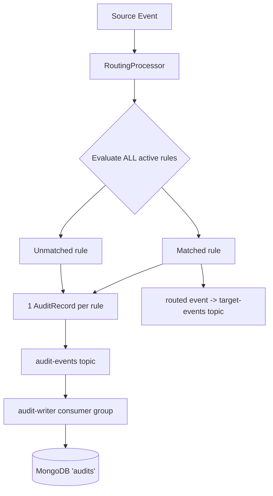
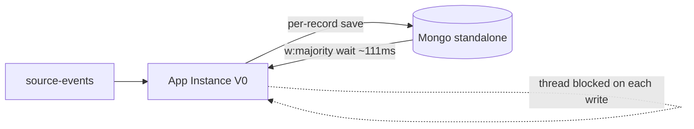
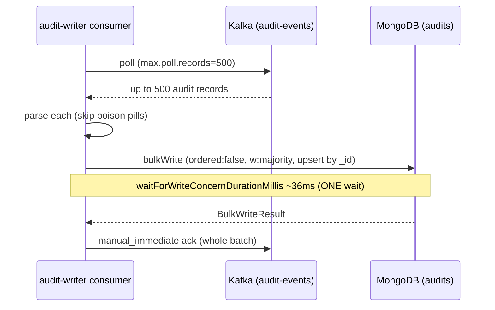
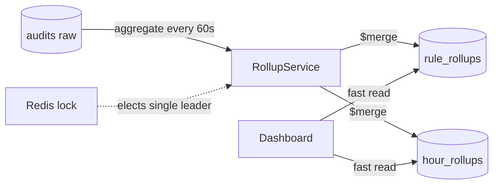
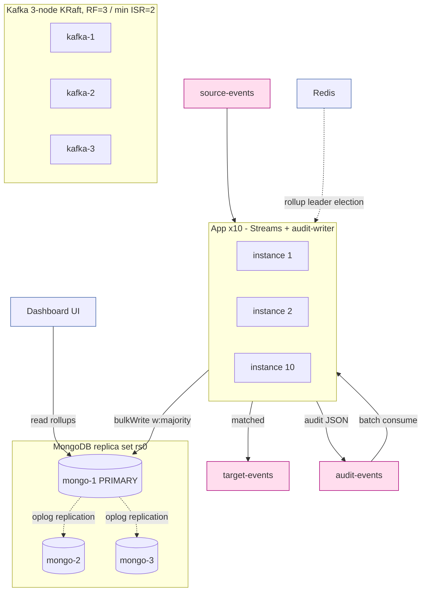

# Architecture Evolution: From Single-Node V0 to Distributed High-Throughput

## Executive Summary
This document reviews the architectural evolution of the rule-audit system from a single-node V0 prototype to a distributed, high-throughput cluster. The core workload is a **volume problem**: processing **100k input events** multiplied by **~100 active rules** generates approximately **10M audit records per run**. The evolution focused on decoupling the Kafka Streams processing thread from persistence, batching write operations to amortize replication cost, and scaling horizontally to absorb the audit volume.

## The Workload
The system is not a high-rate streaming problem but a massive volume problem. The `RoutingProcessor` in the Kafka Streams topology performs a fan-out: for every source event it evaluates **all active rules** and emits **one audit record per rule** (matched rules additionally produce a routed event).

* **Input:** 100k events per run.
* **Fan-out:** ~100 active rules per event.
* **Output:** ~10M audit records per run.
* **Pressure point:** the persistence layer — the cost of writing ~10M documents under `w:majority` write concern.



## V0: The Starting Point
V0 was a monolithic prototype built for rapid iteration, not production scale.

* **Infrastructure:** single Kafka node, standalone MongoDB, single application instance.
* **Data flow:** the application evaluated rules and persisted each audit immediately.
* **Persistence:** reactive, **per-record** writes to the `audits` collection.
* **Analytics:** the dashboard scanned the raw `audits` collection directly, which grew prohibitively slow as data accumulated.

### Bottlenecks
The dominant bottleneck was the per-record write path: each audit write waited on MongoDB replication acknowledgment under `w:majority`.

> **Evidence — MongoDB slow-query log (V0, per-record write)**
> ```
> ns:        ruleaudit.audits
> command:   update (upsert), writeConcern { w: "majority" }
> durationMillis:                  112
>   waitForWriteConcernDurationMillis: 111   <- ~all of it
>   cpuNanos:                          152916 (~0.15ms actual work)
>   numYields:                         0
> ```
> *Analysis: the storage engine finished the write in well under 1ms; the full ~111ms was spent waiting for a majority of replica-set members to acknowledge. At ~112ms per record this caps a single writer near ~9 audits/sec — nowhere near the 10M-record volume.*



## The Evolution
Each step below follows a Problem -> Change -> Result shape.

### 1. Topic-Based Decoupling
**Problem:** the processing thread was blocked on Mongo I/O for every audit.
**Change:** the Kafka Streams thread no longer touches Mongo. It forwards audit JSON to the `audit-events` topic and routed/matched events to `target-events`. A separate consumer group (`audit-writer`) drains `audit-events` into Mongo.
**Result:** evaluation throughput is fully decoupled from database latency — the "async write" is achieved by a topic boundary, not by fire-and-forget callbacks.

### 2. Batch Consume + Bulk Write
**Problem:** per-record `w:majority` writes paid ~111ms of replication wait *each*.
**Change:** the `audit-writer` consumes in batches (`max.poll.records=500`, `fetch.min.bytes≈1MiB`, `fetch.max.wait.ms=200`) and persists each poll with a single unordered Mongo `bulkWrite` (`ordered:false`), paying the `w:majority` wait **once per batch**.
**Result:** the replication wait is amortized across the whole batch.

> **Evidence — MongoDB slow-query log (current, batched bulk write)**
> ```
> ns:        ruleaudit.audits
> command:   update, ordered: false, writeConcern { w: "majority" }, 500 ops
> durationMillis:                  109
>   waitForWriteConcernDurationMillis: 36    <- ONCE for the whole batch
>   cpuNanos:                          ~27.4ms (500 upserts)
> ```
> *Analysis: ~109ms for 500 documents = **~0.22ms per record** total, vs ~112ms per record in V0. The majority replication wait collapses from one-per-record (~111ms each) to one-per-batch (~36ms, ~0.07ms/record amortized). Measured ~4,600 audit-writes/sec per consumer thread. Note the log line still trips the 100ms "slow query" threshold — but now it is one line per 500 records doing real work, not 500 lines of replication stall.*



### 3. Idempotent Bulk Upserts
**Problem:** redelivery of an un-acked batch could duplicate writes.
**Change:** the audit `_id` is deterministic — `topic:partition:offset:ruleId` (AuditKey) — and writes are upserts keyed on `_id`. The batch is acked only after `bulkWrite` succeeds. A bounded `DefaultErrorHandler` (`FixedBackOff` 1s × 5) prevents a persistent failure from stalling the partition forever.
**Result:** at-least-once delivery with idempotent persistence — redelivery re-upserts the same `_id` and is a no-op.

### 4. Pre-Aggregated Rollups
**Problem:** dashboard scans of the raw `audits` collection were too slow.
**Change:** `RollupService` recomputes hourly/per-rule buckets every 60s using MongoDB `$merge` into `rule_rollups` and `hour_rollups`. A Redis lock elects a single instance to run the rollup so the 10 replicas don't duplicate the work.
**Result:** the dashboard reads small pre-aggregated collections instead of scanning millions of raw documents.



### 5. Horizontal Scale-Out
**Problem:** a single instance could not absorb the fan-out volume.
**Change:** 20 Kafka partitions and up to 10 application instances (`APP_REPLICAS:-10`); the `audit-writer` consumer group rebalances across instances automatically.
**Result:** evaluation and audit persistence scale out across the cluster, bounded by partition count.

### 6. Clustering for HA
**Problem:** single points of failure in V0.
**Change:**
* **Kafka:** 3-node KRaft cluster (combined broker+controller, quorum across all three); offsets and transaction-state topics at RF=3, transaction-state min ISR=2.
* **MongoDB:** 3-node replica set (`rs0`).
* **Topics:** `APP_REPLICATION_FACTOR=3` in cluster mode.
**Result:** the pipeline survives the loss of any single broker or Mongo node.

### 7. Resource Bounding
**Problem:** JVM OOMs under load and WiredTiger cache thrash.
**Change:** per-JVM heap bounded (`-Xmx512m -Xms256m`) with a 2G container limit so 10 replicas don't exhaust the Docker VM; MongoDB WiredTiger cache sized via `--wiredTigerCacheSizeGB ${MONGO_WT_CACHE_GB:-4}` with raised container limits in cluster mode.
**Result:** stable memory footprint under sustained 10M-record runs.

## Current Architecture
* **Processing:** `rule-audit-streams` (Kafka Streams) runs `processing.guarantee=exactly_once_v2` over 20 partitions (`num.stream.threads=1` per instance).
* **Persistence:** the `audit-writer` group consumes `audit-events` with `isolation.level=read_committed` and `ack-mode=manual_immediate`, writing via batched `bulkWrite` at `w:majority`.
* **Analytics:** the dashboard reads pre-aggregated `rule_rollups` / `hour_rollups`.



## V0 vs Current

The same pipeline, re-shaped at three points: the Mongo write moves off the Kafka thread behind a topic, per-record writes become one bulk write per batch, and the standalone node becomes a replica set.


| Feature | V0 (prototype) | Current (cluster) |
| :--- | :--- | :--- |
| **Kafka** | 1 node (RF=1, ISR=1) | 3-node KRaft (RF=3, min ISR=2) |
| **MongoDB** | standalone | 3-node replica set (`rs0`) |
| **App instances** | 1 | 10 (default) |
| **Partitions** | 1 | 20 |
| **Write model** | per-record reactive save | batched bulk upsert (500/poll) |
| **Write-concern cost** | ~112ms/record (111ms WC wait) | ~0.22ms/record total (~0.07ms WC wait, amortized) |
| **Audit↔Mongo coupling** | inline on processing thread | decoupled via `audit-events` topic |
| **Analytics** | scan raw `audits` | read pre-aggregated rollups |
| **Failure tolerance** | single point of failure | quorum-tolerant (any 1 node) |
| **Latency** | low (synchronous) | higher (batching/linger window) |

## Deployment & Networking
Both profiles live in one `docker-compose.yml`, selected by `run.sh`.

* **Single-node (dev / V0):** `kafka` (single KRaft), `mongo` (standalone), `redis`; `APP_REPLICATION_FACTOR=1`.
* **Cluster (scaled / current):** `kafka-1/2/3`, `mongo-1/2/3` (replica set `rs0`), `redis`; `APP_REPLICATION_FACTOR=3`.

**Configuration strategy:**
* **Dynamic ports:** `run.sh` probes for free ports so 10 app replicas and the infra nodes coexist on one host without conflicts.
* **Networking:** containers reach host-mapped ports via `host.docker.internal`; cluster mode builds `MONGODB_URI=...,...,.../ruleaudit?replicaSet=rs0`.
* **Environment knobs:** `APP_REPLICAS` (horizontal scale), `MONGO_WT_CACHE_GB` (WiredTiger cache, default 4), `APP_REPLICATION_FACTOR` (Kafka topic RF).

## Trade-offs & Limits
* **End-to-end latency:** batching plus `fetch.max.wait.ms=200` adds a small linger window — an audit is visible in Mongo only after its batch is written (sub-second under load). Acceptable for an audit log.
* **Bounded retry, then skip:** the `audit-writer` retries a failed batch 5× (1s apart); on exhaustion it is **logged and the offset is committed (skipped)** to avoid stalling the partition. There is **no** DLT recoverer wired to the audit consumer today — `audit-events.DLT` exists as a topic but is not published to from this path. For zero-loss, switch the handler to unbounded retry or wire a `DeadLetterPublishingRecoverer`.
* **At-least-once to Mongo (not exactly-once):** Streams gives `exactly_once_v2` up to the topics; the Mongo write is at-least-once. Idempotent `_id` upserts make redelivery safe (no duplicates), but the audit write is not transactionally tied to the Kafka commit.
* **Single-host Docker contention:** when all replica-set members share one Docker host they contend for CPU/IO, inflating `waitForWriteConcernDurationMillis`. Real multi-host deployment reduces this.
* **Rollup staleness:** rollups recompute every 60s, so dashboard figures can lag up to ~60s.

## Future Work
* **Partition vs instance balance:** revisit whether 20 partitions is the right ceiling for 10 instances (and `num.stream.threads`).
* **DLQ wiring:** add a `DeadLetterPublishingRecoverer` + a consumer on `audit-events.DLT` for alerting/remediation.
* **Sharding / archival:** shard or TTL the `audits` collection (by time or rule) to cap storage as runs accumulate.
